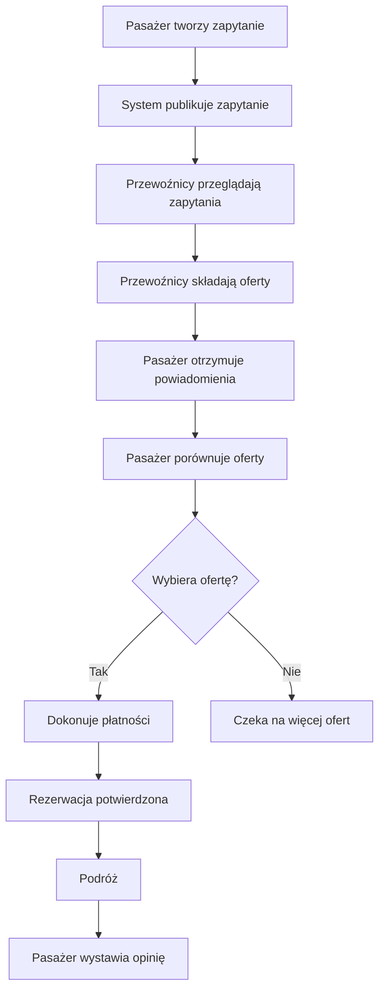
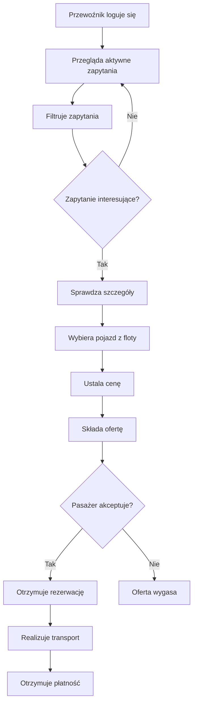

# Plan Aplikacji - Platforma Transportowa

## 1. Opis Aplikacji

**Nazwa:** TransportConnect (propozycja)

**Cel:** Platforma łącząca grupy osób poszukujących transportu z przewoźnikami oferującymi busy, autobusy i inne pojazdy wieloosobowe.

**Model biznesowy:** Marketplace dla transportu grupowego

---

## 2. Główne Funkcjonalności

### 2.1 Panel Pasażera
- ✅ Tworzenie zapytania o transport
- ✅ Przeglądanie otrzymanych ofert od przewoźników
- ✅ Porównywanie ofert (cena, pojazd, opinie)
- ✅ Wybór i rezerwacja transportu
- ✅ Płatność online
- ✅ Śledzenie statusu rezerwacji
- ✅ Ocena przewoźnika po zakończeniu usługi
- ✅ Historia rezerwacji

### 2.2 Panel Przewoźnika
- ✅ Przeglądanie zapytań o transport
- ✅ Filtrowanie zapytań (data, trasa, liczba osób)
- ✅ Składanie ofert
- ✅ Zarządzanie flotą pojazdów
- ✅ Kalendarz rezerwacji
- ✅ Panel finansowy (rozliczenia, faktury)
- ✅ Statystyki i raporty
- ✅ Profil firmy i zarządzanie opiniami

### 2.3 Panel Administratora
- ✅ Moderacja użytkowników i przewoźników
- ✅ Weryfikacja przewoźników (licencje, ubezpieczenia)
- ✅ Zarządzanie prowizjami
- ✅ Rozwiązywanie sporów
- ✅ Statystyki platformy

---

## 3. Struktura Danych

### 3.1 User (Użytkownik)
```typescript
interface User {
  id: string;
  email: string;
  password: string; // hashed
  firstName: string;
  lastName: string;
  phone: string;
  role: 'passenger' | 'carrier' | 'admin';
  avatar?: string;
  createdAt: Date;
  updatedAt: Date;
  verified: boolean;
  verificationToken?: string;
}
```

### 3.2 Carrier (Przewoźnik)
```typescript
interface Carrier {
  id: string;
  userId: string; // relacja do User
  companyName: string;
  taxId: string; // NIP
  address: {
    street: string;
    city: string;
    postalCode: string;
    country: string;
  };
  licenseNumber: string;
  insuranceNumber: string;
  insuranceExpiryDate: Date;
  status: 'pending' | 'verified' | 'suspended' | 'rejected';
  rating: number; // średnia ocen 0-5
  reviewCount: number;
  description?: string;
  logo?: string;
  bankAccount?: string;
  createdAt: Date;
  updatedAt: Date;
}
```

### 3.3 Vehicle (Pojazd)
```typescript
interface Vehicle {
  id: string;
  carrierId: string;
  type: 'minibus' | 'bus' | 'coach' | 'van';
  brand: string;
  model: string;
  year: number;
  registrationNumber: string;
  capacity: number; // liczba miejsc
  features: string[]; // ['klimatyzacja', 'wifi', 'toaleta', 'gniazdka', 'bagażnik']
  images: string[];
  status: 'active' | 'maintenance' | 'inactive';
  createdAt: Date;
  updatedAt: Date;
}
```

### 3.4 TransportRequest (Zapytanie o transport)
```typescript
interface TransportRequest {
  id: string;
  userId: string; // pasażer
  status: 'active' | 'offers_received' | 'booked' | 'completed' | 'cancelled';

  // Szczegóły trasy
  from: {
    address: string;
    city: string;
    coordinates?: {
      lat: number;
      lng: number;
    };
  };
  to: {
    address: string;
    city: string;
    coordinates?: {
      lat: number;
      lng: number;
    };
  };

  // Szczegóły podróży
  departureDate: Date;
  returnDate?: Date; // opcjonalnie dla podróży powrotnej
  isRoundTrip: boolean;
  passengerCount: number;

  // Dodatkowe informacje
  luggageInfo?: string;
  specialRequirements?: string;
  budget?: {
    min?: number;
    max?: number;
    currency: string;
  };

  // Statystyki
  viewCount: number; // ile przewoźników obejrzało
  offerCount: number; // ile ofert otrzymano

  createdAt: Date;
  updatedAt: Date;
  expiresAt: Date; // automatyczne wygaszenie po X dniach
}
```

### 3.5 Offer (Oferta przewoźnika)
```typescript
interface Offer {
  id: string;
  requestId: string;
  carrierId: string;
  vehicleId: string;

  status: 'pending' | 'accepted' | 'rejected' | 'expired';

  // Cena
  price: number;
  currency: string;
  priceBreakdown?: {
    basePrice: number;
    fuelSurcharge?: number;
    additionalServices?: number;
  };

  // Szczegóły oferty
  description?: string;
  includedServices: string[]; // ['wifi', 'napoje', 'klimatyzacja']
  cancellationPolicy: string;

  // Harmonogram
  proposedDeparture: Date;
  proposedReturn?: Date;
  estimatedDuration: number; // w minutach

  validUntil: Date; // oferta ważna do

  createdAt: Date;
  updatedAt: Date;
}
```

### 3.6 Booking (Rezerwacja)
```typescript
interface Booking {
  id: string;
  requestId: string;
  offerId: string;
  userId: string; // pasażer
  carrierId: string;
  vehicleId: string;

  status:
    | 'pending_payment'
    | 'confirmed'
    | 'in_progress'
    | 'completed'
    | 'cancelled_by_passenger'
    | 'cancelled_by_carrier';

  // Finansowe
  totalPrice: number;
  currency: string;
  platformFee: number; // prowizja platformy
  carrierPayout: number; // wypłata dla przewoźnika

  // Dane pasażerów
  passengers: {
    firstName: string;
    lastName: string;
    phone?: string;
    email?: string;
  }[];

  // Szczegóły podróży (skopiowane z oferty)
  departureDate: Date;
  returnDate?: Date;
  from: Location;
  to: Location;

  // Płatność
  paymentId?: string;
  paymentMethod?: 'card' | 'bank_transfer' | 'blik';
  paymentStatus: 'pending' | 'completed' | 'failed' | 'refunded';
  paidAt?: Date;

  // Anulowanie
  cancellationReason?: string;
  cancelledAt?: Date;
  refundAmount?: number;

  createdAt: Date;
  updatedAt: Date;
  completedAt?: Date;
}
```

### 3.7 Review (Opinia)
```typescript
interface Review {
  id: string;
  bookingId: string;
  userId: string; // kto wystawił opinię
  carrierId: string; // o kim

  rating: number; // 1-5
  categories: {
    punctuality: number; // 1-5
    vehicleCondition: number; // 1-5
    driverBehavior: number; // 1-5
    valueForMoney: number; // 1-5
  };

  comment?: string;
  photos?: string[];

  // Odpowiedź przewoźnika
  response?: {
    text: string;
    respondedAt: Date;
  };

  verified: boolean; // czy zweryfikowana przez system

  createdAt: Date;
  updatedAt: Date;
}
```

### 3.8 Notification (Powiadomienie)
```typescript
interface Notification {
  id: string;
  userId: string;
  type:
    | 'new_offer'
    | 'offer_accepted'
    | 'offer_rejected'
    | 'payment_received'
    | 'booking_confirmed'
    | 'booking_cancelled'
    | 'trip_reminder'
    | 'review_received';

  title: string;
  message: string;
  data?: Record<string, any>; // dodatkowe dane

  read: boolean;
  readAt?: Date;

  createdAt: Date;
}
```

---

## 4. Flow Użytkownika

### 4.1 Proces Rezerwacji (Pasażer)



### 4.2 Proces Składania Oferty (Przewoźnik)



---

## 5. Stack Technologiczny (Propozycja)

### Frontend
- **Framework:** Next.js 15 (App Router)
- **Język:** TypeScript
- **Styling:** Tailwind CSS
- **UI Components:** Shadcn/ui lub Radix UI
- **Formularze:** React Hook Form + Zod
- **Mapy:** Google Maps API lub Mapbox
- **Zarządzanie stanem:** Zustand lub React Context
- **Data fetching:** React Query (TanStack Query)

### Backend
- **API:** Next.js API Routes lub tRPC
- **Database:** PostgreSQL (Supabase lub Neon)
- **ORM:** Prisma
- **Autentykacja:** NextAuth.js
- **File storage:** AWS S3 lub Cloudinary (zdjęcia, dokumenty)
- **Płatności:** Stripe lub PayU
- **Email:** Resend lub SendGrid
- **Notifications:** Firebase Cloud Messaging (FCM)

### Deployment
- **Hosting:** Vercel
- **Database:** Supabase / Neon
- **CDN:** Vercel Edge Network

---

## 6. Kluczowe Funkcje do Implementacji

### Faza 1: MVP (Minimum Viable Product)
- [ ] Rejestracja i logowanie (pasażer + przewoźnik)
- [ ] Tworzenie zapytania o transport (pasażer)
- [ ] Lista zapytań (przewoźnik)
- [ ] Składanie oferty (przewoźnik)
- [ ] Lista ofert (pasażer)
- [ ] Podstawowa rezerwacja (bez płatności)
- [ ] Profil użytkownika
- [ ] Profil przewoźnika

### Faza 2: Rozszerzenie
- [ ] Integracja płatności (Stripe/PayU)
- [ ] System opinii i ocen
- [ ] Zaawansowane filtrowanie
- [ ] System powiadomień
- [ ] Panel administracyjny
- [ ] Weryfikacja przewoźników
- [ ] Historia transakcji

### Faza 3: Zaawansowane Funkcje
- [ ] Mapa z trasami
- [ ] Czat pasażer-przewoźnik
- [ ] Aplikacja mobilna (React Native)
- [ ] Automatyczne przypomnienia
- [ ] System rabatów i promocji
- [ ] Program lojalnościowy
- [ ] Analityka i raporty
- [ ] API dla partnerów

---

## 7. Kwestie Bezpieczeństwa

- 🔒 Szyfrowanie haseł (bcrypt)
- 🔒 HTTPS/SSL
- 🔒 Weryfikacja email i telefonu
- 🔒 Weryfikacja dokumentów przewoźników
- 🔒 Tokenizacja płatności (PCI DSS)
- 🔒 Rate limiting API
- 🔒 CAPTCHA na formularzach
- 🔒 Regularne backupy bazy danych
- 🔒 GDPR compliance (zgody, polityka prywatności)

---

## 8. Model Monetyzacji

### Opcje:
1. **Prowizja od transakcji:** 5-15% od każdej rezerwacji
2. **Subskrypcje dla przewoźników:**
   - Basic (darmowy): 3 oferty/miesiąc
   - Pro (99 zł/mies): nieograniczone oferty + priorytet w wynikach
   - Premium (299 zł/mies): wszystko + dedykowany manager
3. **Reklamy:** wyróżnienie oferty przewoźnika
4. **Opłata za premium features:** raportowanie, analityka zaawansowana

---

## 9. Metryki Sukcesu (KPI)

- Liczba aktywnych użytkowników (pasażerzy + przewoźnicy)
- Liczba utworzonych zapytań
- Conversion rate (zapytania → rezerwacje)
- Średnia wartość transakcji
- Średni czas odpowiedzi przewoźnika
- Średnia ocena przewoźników
- Retencja użytkowników (powracający klienci)
- Przychód platformy (GMV - Gross Merchandise Value)

---

## 10. Roadmap

**Q1 2025:**
- Projektowanie UX/UI
- Setup projektu
- Implementacja MVP (Faza 1)
- Beta testing z wybranymi przewoźnikami

**Q2 2025:**
- Integracja płatności
- System opinii
- Marketing i onboarding przewoźników
- Soft launch

**Q3 2025:**
- Zbieranie feedbacku
- Iteracje i poprawki
- Dodatkowe funkcje (Faza 2)
- Rozszerzenie na nowe regiony

**Q4 2025:**
- Aplikacja mobilna
- Zaawansowane funkcje (Faza 3)
- Skalowanie biznesu
- Pozyskiwanie inwestycji (opcjonalnie)

---

## 11. Konkurencja i USP

### Konkurencja:
- BlaBlaCar (car pooling)
- FlixBus (busy międzymiastowe)
- Transfer24 (busy wycieczkowe)
- Lokalne firmy transportowe

### USP (Unique Selling Proposition):
✨ **Marketplace model** - konkurencja ofert = niższe ceny
✨ **Elastyczność** - dowolna trasa, dowolna data
✨ **Transparentność** - system opinii i weryfikacji
✨ **Wygoda** - wszystko online, jedna platforma
✨ **Dla grup** - specjalizacja w transporcie grupowym

---

## 12. Pytania do Rozważenia

1. Czy platforma będzie działać lokalnie (Polska) czy międzynarodowo?
2. Jaki minimalny rozmiar grupy (min. liczba pasażerów)?
3. Czy przewoźnicy mogą proponować stałe trasy (regularne linie)?
4. Jak długo oferta powinna być ważna?
5. Jaki jest proces weryfikacji przewoźników?
6. Czy pasażerowie mogą negocjować ceny?
7. Czy będzie możliwość współdzielenia kosztów (np. połowa busa)?
8. Jak obsłużyć anulacje i zwroty?

---

## Następne Kroki

1. ✅ Zatwierdzenie planu
2. 📋 Projektowanie mockupów w Figma
3. 🗄️ Setup bazy danych (schema Prisma)
4. 🎨 Implementacja layoutu i nawigacji
5. 👤 System autentykacji
6. 📝 Formularz zapytania o transport
7. 📊 Dashboard przewoźnika
8. 💰 Integracja płatności

---

**Dokument stworzony:** 2025-11-17
**Autor:** Claude + Bartek
**Wersja:** 1.0
